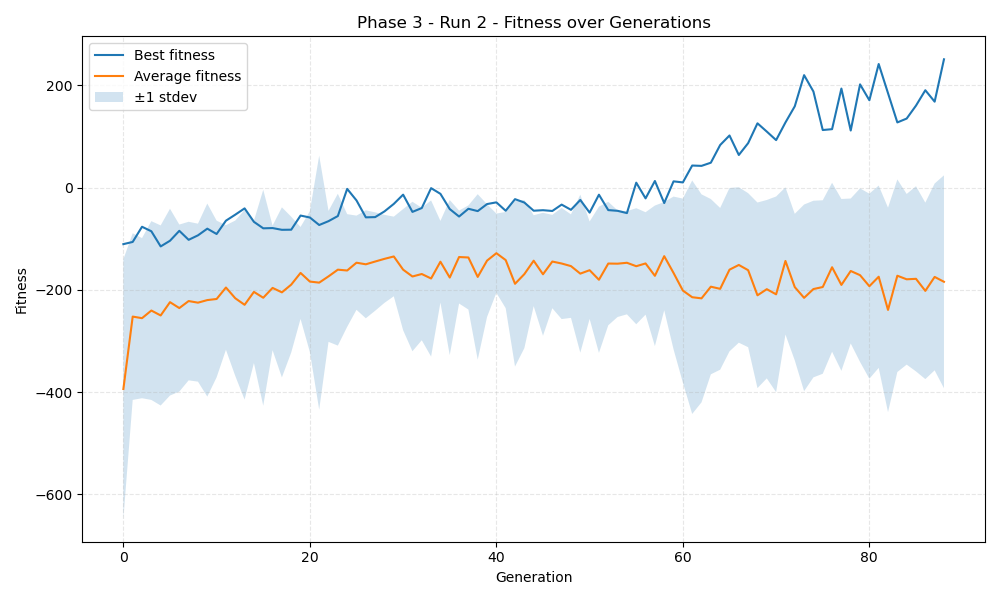
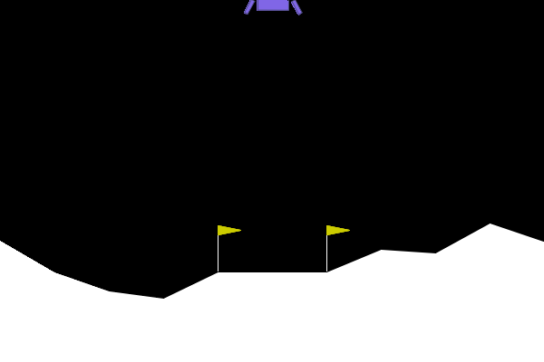

## LunarLander NEAT Results – Phase 3, Run 2

### Training Summary
- Generations run: **89**
- Training fitness threshold: **250.0**
- Winner training fitness (runs_per_net=10): **250.71**
- Training solved (by threshold)? **YES**
- Training time (population.run): **51.8 seconds**

### Evaluation Summary
- Evaluation episodes: **100**
- Evaluation mean fitness: **164.55**
- Evaluation solved (mean ≥ 200)? **NO**

### Fitness Plot

### Winning Genome Visualization

### Winner Network Diagram

### Winning Genome Configuration
- Input nodes (8): `[-8, -7, -6, -5, -4, -3, -2, -1]`
- Hidden nodes (4): `[168, 171, 333, 387]`
- Output nodes (4): `[0, 1, 2, 3]`
- Total enabled connections: **50**
- Pickled winner genome: `genomes/winning_genome_3.2.pickle`

#### Node Details
| Node ID | Type   | Activation | Bias   |
| ------- | ------ | ---------- | ------ |
| -8 | input | N/A | N/A |
| -7 | input | N/A | N/A |
| -6 | input | N/A | N/A |
| -5 | input | N/A | N/A |
| -4 | input | N/A | N/A |
| -3 | input | N/A | N/A |
| -2 | input | N/A | N/A |
| -1 | input | N/A | N/A |
| 168 | hidden | clamped | -0.991 |
| 171 | hidden | clamped | 0.369 |
| 333 | hidden | clamped | -0.201 |
| 387 | hidden | clamped | 0.799 |
| 0 | output | clamped | -1.151 |
| 1 | output | clamped | 0.567 |
| 2 | output | clamped | 0.245 |
| 3 | output | clamped | 0.871 |

#### Connection Details
| From | To | Weight   | Enabled |
| ---- |----|----------|---------|
| -8 | 0 | -0.458 | True |
| -8 | 1 | -0.091 | True |
| -8 | 2 | 0.163 | True |
| -8 | 3 | -1.112 | True |
| -8 | 168 | 0.318 | True |
| -8 | 171 | -1.085 | True |
| -7 | 0 | 0.123 | False |
| -7 | 1 | -2.326 | True |
| -7 | 2 | -1.631 | True |
| -7 | 3 | -1.377 | True |
| -7 | 168 | -0.068 | True |
| -7 | 171 | -1.348 | False |
| -6 | 0 | 0.708 | True |
| -6 | 1 | -0.482 | True |
| -6 | 2 | -0.305 | True |
| -6 | 3 | -0.447 | True |
| -6 | 168 | 1.438 | False |
| -6 | 171 | -1.005 | True |
| -5 | 0 | -0.376 | True |
| -5 | 1 | -1.850 | True |
| -5 | 2 | -0.984 | True |
| -5 | 3 | -0.105 | True |
| -5 | 168 | -0.367 | True |
| -5 | 171 | -1.004 | True |
| -4 | 0 | 1.179 | True |
| -4 | 1 | 0.091 | True |
| -4 | 2 | -2.405 | True |
| -4 | 3 | 0.588 | True |
| -4 | 168 | 0.581 | False |
| -4 | 171 | 2.398 | True |
| -3 | 0 | 0.695 | True |
| -3 | 1 | 1.125 | True |
| -3 | 2 | -1.629 | True |
| -3 | 3 | -0.271 | True |
| -3 | 168 | -0.774 | True |
| -3 | 171 | 0.973 | True |
| -2 | 0 | -0.038 | True |
| -2 | 1 | 0.660 | True |
| -2 | 2 | -1.212 | True |
| -2 | 3 | 0.466 | True |
| -2 | 168 | 1.873 | True |
| -2 | 171 | 0.498 | False |
| -1 | 0 | -0.706 | True |
| -1 | 1 | -0.105 | True |
| -1 | 2 | -0.161 | True |
| -1 | 3 | -0.039 | True |
| -1 | 168 | -0.630 | True |
| -1 | 171 | 1.088 | False |
| 168 | 0 | 0.494 | True |
| 168 | 1 | -0.580 | True |
| 168 | 2 | -2.759 | False |
| 168 | 3 | 0.630 | True |
| 171 | 0 | 0.244 | True |
| 171 | 1 | 0.343 | True |
| 171 | 2 | -1.341 | False |
| 171 | 3 | 0.884 | False |
| 171 | 333 | 0.867 | True |
| 171 | 387 | -1.475 | True |
| 333 | 2 | -0.546 | False |
| 387 | 3 | 0.618 | True |