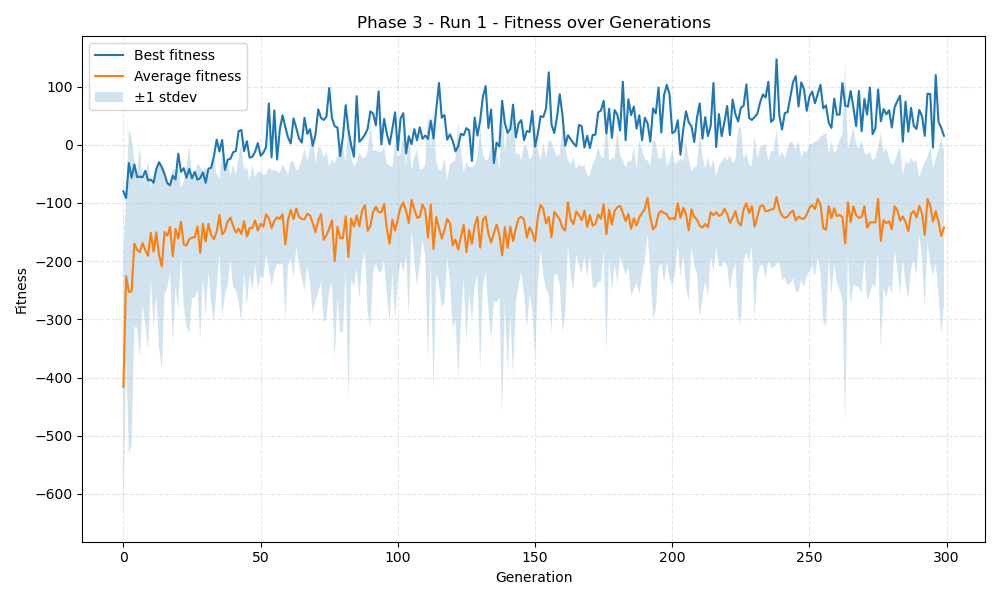
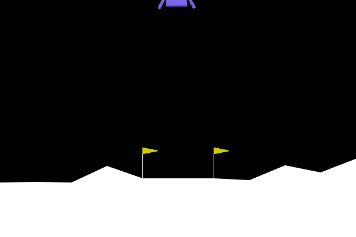
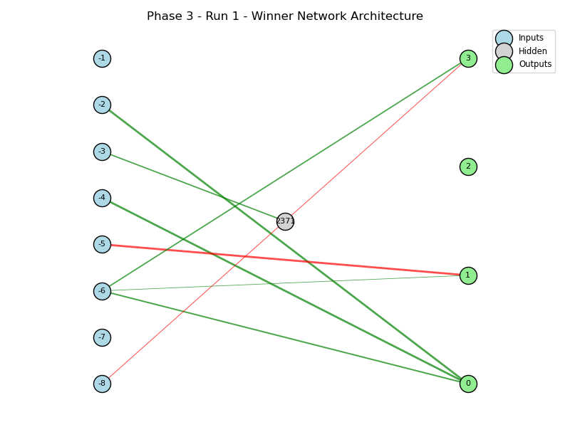

## LunarLander NEAT Results – Phase 3, Run 1

### Training Summary
- Generations run: **300**
- Training fitness threshold: **250.0**
- Winner training fitness (runs_per_net=10): **15.30**
- Training solved (by threshold)? **NO**
- Training time (population.run): **79.3 seconds**

### Evaluation Summary
- Evaluation episodes: **100**
- Evaluation mean fitness: **-1.43**
- Evaluation solved (mean ≥ 200)? **NO**

### Fitness Plot

### Winning Genome Visualization

### Winner Network Diagram

### Winning Genome Configuration
- Input nodes (8): `[-8, -7, -6, -5, -4, -3, -2, -1]`
- Hidden nodes (1): `[2371]`
- Output nodes (4): `[0, 1, 2, 3]`
- Total enabled connections: **9**
- Pickled winner genome: `genomes/winning_genome_3.1.pickle`

#### Node Details
| Node ID | Type   | Activation | Bias   |
| ------- | ------ | ---------- | ------ |
| -8 | input | N/A | N/A |
| -7 | input | N/A | N/A |
| -6 | input | N/A | N/A |
| -5 | input | N/A | N/A |
| -4 | input | N/A | N/A |
| -3 | input | N/A | N/A |
| -2 | input | N/A | N/A |
| -1 | input | N/A | N/A |
| 2371 | hidden | clamped | 0.169 |
| 0 | output | clamped | 1.262 |
| 1 | output | clamped | -1.460 |
| 2 | output | clamped | -0.660 |
| 3 | output | clamped | -0.392 |

#### Connection Details
| From | To | Weight   | Enabled |
| ---- |----|----------|---------|
| -8 | 2371 | -0.760 | True |
| -6 | 0 | 3.132 | True |
| -6 | 1 | 0.260 | True |
| -6 | 3 | 2.658 | True |
| -5 | 1 | -15.640 | True |
| -4 | 0 | 6.792 | True |
| -3 | 3 | 1.828 | False |
| -3 | 2371 | 2.612 | True |
| -2 | 0 | 6.014 | True |
| 2371 | 3 | -0.721 | True |